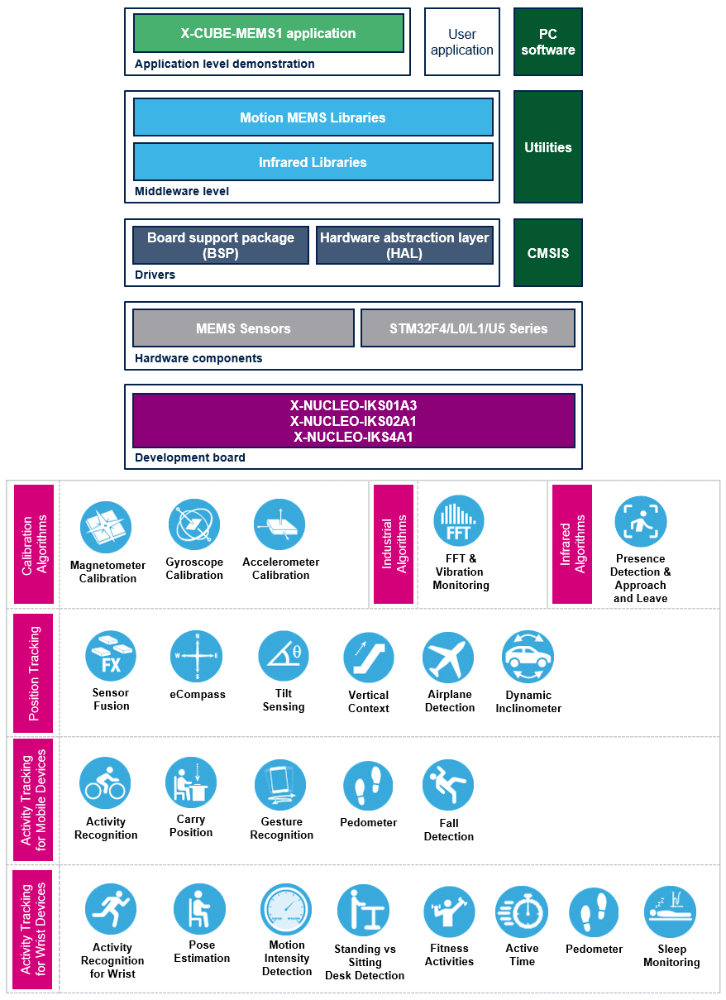

# X-CUBE-MEMS1 Firmware Package

The X-CUBE-MEMS1 expansion software package for STM32Cube runs on the STM32 and includes drivers that recognize the sensors and collect temperature, humidity, pressure and motion data. The expansion is built on STM32Cube software technology to ease portability across different STM32 microcontrollers. The software comes with a sample implementation of the drivers running on the X-NUCLEO-IKS01A2, X-NUCLEO-IKS01A3 and X-NUCLEO-IKS02A1 expansion boards connected to a featured STM32 Nucleo development board. The software provides sample applications and advanced motion libraries: MotionAC accelerometer calibration, MotionAD airplane detection, MotionAR activity recognition, MotionAT active time, MotionAW activity recognition for wrist, MotionCP real-time carry position, MotionDI dynamic inclinometer, MotionEC real-time ecompass, MotionFA fitness activity, MotionFD real-time fall detection, MotionFX sensor fusion, MotionGC gyroscope calibration, MotionGR real-time gesture recognition, MotionID motion intensity detection, MotionMC magnetometer calibration, MotionPE real-time pose estimation, MotionPM real-time pedometer library, MotionPW real-time pedometer for wrist, MotionSD standing vs sitting desk detection, MotionTL tilt measurement and MotionVC vertical context libraries.

**X-CUBE-MEMS1 software features**:

- Complete software to build applications using the following sensors:

  - temperature and humidity sensors: HTS221 for X-NUCLEO-IKS01A2 and X-NUCLEO-IKS01A3
  - pressure sensor: LPS22HB for X-NUCLEO-IKS01A2, LPS22HH for XNUCLEO-IKS01A3
  - temperature sensors: STTS751 for X-NUCLEO-IKS01A3
  - motion sensors: LSM303AGR and LSM6DSL for X-NUCLEO-IKS01A2, LIS2MDL, LIS2DW12 and LSM6DSO for X-NUCLEO-IKS01A3, ISM330DHCX, IIS2DLPC and IIS2MDC for X-NUCLEO-IKS02A1
  - audio sensor: IMP34DT05 for X-NUCLEO-IKS02A1

- Several examples to show the innovative inertial and environmental sensors

- Sample application to transmit real-time sensor data to a PC

- Compatible with the Unicleo-GUI graphical user interface to display sensor data and configure outputs

- Sample implementation available on the X-NUCLEO-IKS01A2, X-NUCLEOIKS01A3 and X-NUCLEO-IKS02A1 boards connected to a NUCLEO-F401RE, NUCLEO-L152RE, NUCLEO-L476RG or NUCLEO-L073RZ development board

- Advanced motion libraries with sample applications

- Easy portability across different MCU families, thanks to STM32Cube

- Free, user-friendly license terms

Here is the list of references to user documents:

- [X-NUCLEO-IKS01A2 SCHEMATIC](https://www.st.com/resource/en/schematic_pack/x-nucleo-iks01a2_schematic.pdf)
- [X-NUCLEO-IKS01A3 SCHEMATIC](https://www.st.com/resource/en/schematic_pack/x-nucleo-iks01a3_schematic.pdf)
- [X-NUCLEO-IKS02A1 SCHEMATIC](https://www.st.com/resource/en/schematic_pack/x-nucleo-iks02a1_schematic.pdf)
- [UM2121 Getting started with the X-NUCLEO-IKS01A2 motion MEMS and environmental sensor expansion board for STM32 Nucleo](https://www.st.com/resource/en/user_manual/um2121-getting-started-with-the-xnucleoiks01a2-motion-mems-and-environmental-sensor-expansion-board-for-stm32-nucleo-stmicroelectronics.pdf)
- [UM2559 Getting started with the X-NUCLEO-IKS01A3 motion MEMS and environmental sensor expansion board for STM32 Nucleo](https://www.st.com/resource/en/user_manual/um2559-getting-started-with-the-xnucleoiks01a3-motion-mems-and-environmental-sensor-expansion-board-for-stm32-nucleo-stmicroelectronics.pdf)
- [UM2633 Getting started with the X-NUCLEO-IKS02A1 industrial motion MEMS sensor expansion board for STM32 Nucleo](https://www.st.com/resource/en/user_manual/um2633-getting-started-with-the-xnucleoiks02a1-industrial-motion-mems-sensor-expansion-board-for-stm32-nucleo-stmicroelectronics.pdf)
